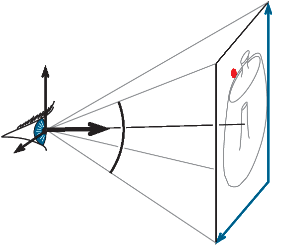
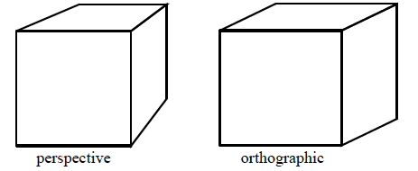
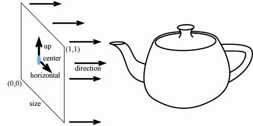

## Ray Casting 1
### Camera
#### Description
• Eye point **e** (center)
• Orthobasis **u, v, w** (horizontal, up, -direction) 
• Field of view **angle**
• Image rectangle **height, width**

#### Perspective vs. Orthographic

Orthographic:
• Parallel projection
• No foreshortening
• No vanishing point

- Origin = center + (x-0.5)\*size\*horizontal + (y-0.5)\*size\*up
- Direction is constant

### Ray-Plane Intersection
#### Plane Representation
